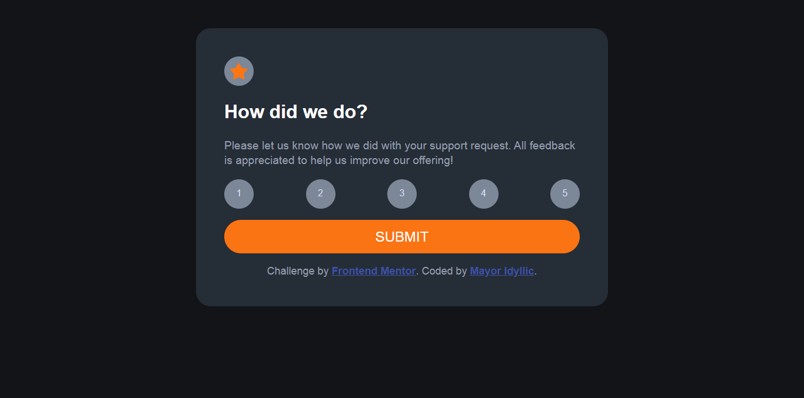

# Frontend Mentor - Interactive rating component solution

This is a solution to the [Interactive rating component challenge on Frontend Mentor](https://www.frontendmentor.io/challenges/interactive-rating-component-koxpeBUmI). Frontend Mentor challenges help you improve your coding skills by building realistic projects. 

## Table of contents

- [Overview](#overview)
  - [The challenge](#the-challenge)
  - [Screenshot](#screenshot)
  - [Links](#links)
  - [Built with](#built-with)
  - [What I learned](#what-i-learned)
  - [Continued development](#continued-development)
  - [Author](#author)

## Overview

### The challenge

Users should be able to:

- View the optimal layout for the app depending on their device's screen size
- See hover states for all interactive elements on the page
- Select and submit a number rating
- See the "Thank you" card state after submitting a rating

### Screenshot




### Links

- Solution URL: [https://github.com/Mayor-Isaac/Rating-page.git]
- Live Site URL:[https://idyllic-rating-page.netlify.app/]


### Built with

- Semantic HTML5 markup
- CSS custom properties
- Flexbox
- Mobile-first workflow
-Vanilla Javascript


### What I learned

```js
const proudOfThisLoop = for(const x of proud){}
```


### Continued development

DRY and code refactoring principle


## Author

- LinkedIn - [Feranmi Ogunyileka](https://www.linkedin.com/in/feranmi-ogunyileka-359a1723b)
- Frontend Mentor - [@Mayor-Isaac](https://www.frontendmentor.io/profile/Mayor-Isaac)
- Twitter - [@mayor_idyllic](https://www.twitter.com/mayor_idyllic)


